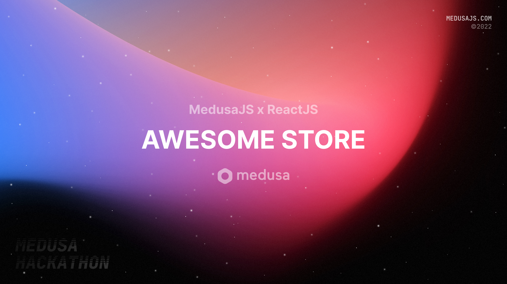

# Medusa Hackathon 2022 - Submission



## About

### Participants
Mursal Furqan - @mursalfk

### Description

An open source ecommerce demo platform highlighting the better usage of MedusaJS on creating a super amazing store front. 

### Preview

]


## Set up Project

### Prerequisites
Before you start with the tutorial make sure you have

- [Node.js](https://nodejs.org/en/) v14 or greater installed on your machine
- [Medusa server](https://docs.medusajs.com/quickstart/quick-start/) v14 or greater installed on your machine

### Install Project

Clone the repository:

```bash
git clone https://github.com/mursalfk/medusa-monorepo.git
```

Change directory and install dependencies:

```
cd admin
npm install
yarn start
cd ..

cd server
npm install
medusa develop
cd ..

cd medusa-store-front
npm install
npm start

```

Start the app

## Resources
- [Medusa’s GitHub repository](https://github.com/medusajs/medusa)
- [Medusa Admin Panel](https://github.com/medusajs/admin)
- [Medusa Documentation](https://docs.medusajs.com/)
